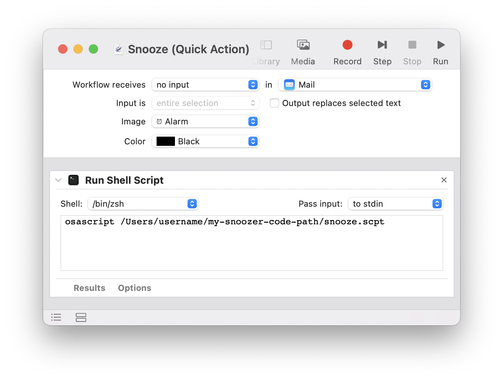
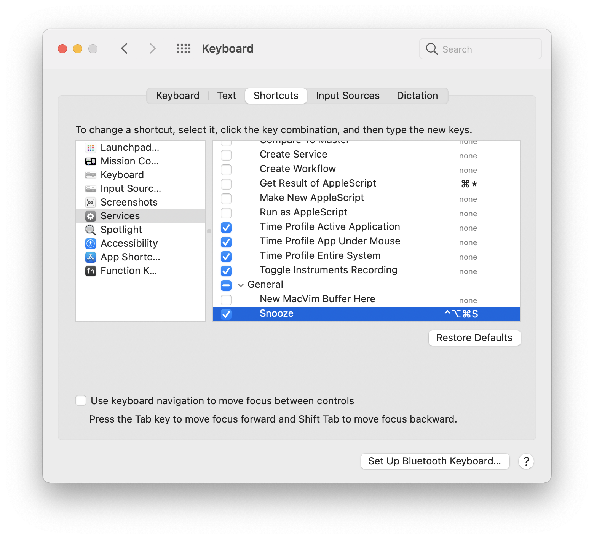

# Apple Mail Snoozer


If you use the Apple Mail client but wish to Snooze emails, then you've come to the right place! With these instructions, you can set up a keyboard shortcut to Snooze emails for an arbitrary number of days.


These instructions have been tested on macOS Big Sur version 11.2.


### How It Works

You can configure a custom keyboard shortcut to snooze a selected message or messages. When a message is **snoozed**, it is flagged a different color and a reminder is created in the Reminders app.

Once the reminder passes its due date, the message will automatically be **unsnoozed** and marked as unread.

If you **manually snooze** a message by setting its flag color, it will automatically unsnooze the next day.

You can **manually unsnooze** an email by changing the flag color.


### Step 1 — Snooze AppleScript

Create a file called `snooze.scpt` with the AppleScript code below. This code gets the currently selected messages, flags them as snoozed, and creates reminders for them in the Reminders app.

```
(* FLAG COLORS
	-1 = no flag
	0 = Red
	1 = Orange
	2 = Yellow
	3 = Green
	4 = Blue
	5 = Purple
	6 = Grey
*)
set snoozeColor to 6 # color to flag snoozed emails
set snoozeListName to "Snoozed Emails" # name of list in Reminders app

set remindersOpen to application "Reminders" is running

tell application "Mail"
	set theMessages to selected messages of first message viewer
	
	# ask user for number of days to snooze the email
	set contFlag to true
	repeat while contFlag
		try
			display dialog "Enter snooze delay (days):" default answer "7"
			set delayDays to text returned of result
		on error errorMsg number errorNumber
			set delayDays to null
			set contFlag to false
		end try
		try # exit loop if input is a valid number
			set delayDays to delayDays as number
			set contFlag to false
		end try
	end repeat
	
	# if the user did not press Cancel, mark as snoozed and make reminder
	if not (delayDays = null) then
		
		# calculate date of the reminder
		set currentDay to (current date) - (time of (current date))
		set reminderDate to currentDay + (delayDays * days)
		
		# mark each message as snoozed
		repeat with theMessage in theMessages
			# SNOOZING BEHAVIOR
			-------------------------------------
			set flag index of theMessage to snoozeColor # change flag
			set read status of theMessage to true # mark read
			-------------------------------------
			log "Snoozing: " & subject of theMessage as string
		end repeat
		
		# create new reminders for each message
		repeat with theMessage in theMessages
			set theSubject to subject of theMessage as rich text
			set theMessageId to message id of theMessage as string
			
			# create new reminder for this message
			tell application "Reminders"
				if not (exists list snoozeListName) then
					# create the reminder list if it doesn't exist
					make new list with properties {name:snoozeListName}
				end if
				set theList to list snoozeListName
				tell theList to make new reminder at end with properties {name:theSubject, due date:reminderDate, body:theMessageId, completed:false}
			end tell
			
		end repeat
		
		# quit the Reminders app if it wasn't previously open
		if not remindersOpen then tell application "Reminders" to quit
	end if
	
end tell
```

You can test this script by running it in the Script Editor application.


### Step 2 — Unsnooze AppleScript

Create a file called `unsnooze.scpt` with the AppleScript code below. This code checks for any reminders that are past their due date, finds the corresponding email to unsnooze, and deletes the reminders. It also checks for any emails that have been flagged as snoozed but lack a corresponding reminder.

```
(* FLAG COLORS
   	-1 = no flag
	0 = Red
	1 = Orange
	2 = Yellow
	3 = Green
	4 = Blue
	5 = Purple
	6 = Grey
*)
set snoozeColor to 6 # color to flag snoozed emails
set unsnoozeColor to 2 # color to flag unsnoozed emails
set snoozeListName to "Snoozed Emails" # name of list in Reminders app

set remindersOpen to application "Reminders" is running
set mailOpen to application "Mail" is running

tell application "Reminders"
	
	# do nothing if reminders list does not exist
	if exists list snoozeListName then
		
		set theList to list snoozeListName
		set dueReminders to (every reminder in theList whose due date is less than (current date))
		repeat with theReminder in dueReminders
			set theId to body of theReminder as string
			
			tell application "Mail"
				try
					set theMessage to (first message of inbox whose message id = theId)
					if flag index of theMessage is snoozeColor then
						# UNSNOOZING BEHAVIOR
						-------------------------------------
						set flag index of theMessage to unsnoozeColor # change flag
						set read status of theMessage to false # mark unread
						-------------------------------------					
						log "Unsnoozing: " & subject of theMessage as string
					end if
				end try
			end tell
			
			set completed of theReminder to true
		end repeat
		
		tell theList
			delete (every reminder whose completed is true)
		end tell
		
		# handle messages flagged as snoozed without corresponding reminder	s
		set allReminders to (every reminder in theList whose completed is false)
		tell application "Mail"
			set snoozedMessages to (every message of inbox whose flag index = snoozeColor)
			repeat with theMessage in snoozedMessages
				set hasReminder to false
				set theMessageId to message id of theMessage as string
				tell application "Reminders"
					repeat with theReminder in allReminders
						if body of theReminder = theMessageId then
							set hasReminder to true
						end if
					end repeat
				end tell
				if hasReminder is false then
					# UNSNOOZING BEHAVIOR
					-------------------------------------
					set flag index of theMessage to unsnoozeColor # change flag
					set read status of theMessage to false # mark unread
					-------------------------------------
				end if
			end repeat
			
			if not mailOpen then quit # quit Mail if not previously open
		end tell
		
	end if
	
	if not remindersOpen then quit # quit Reminders if not previously open
end tell
```


### Step 3 — Launchd Task

Emails are snoozed by the user using a keyboard shortcut. But to unsnooze the emails automatically we need the unsnooze script to automatically run at 12:05 every night. Do do this, create a new file with this name and path: `~/Library/LaunchAgents/com.example.unsnoozer.plist`. Adapt the code below by renaming the path to where the unsnooze script is located.

```xml
<?xml version="1.0" encoding="UTF-8"?>
<!DOCTYPE plist PUBLIC "-//Apple//DTD PLIST 1.0//EN" "http://www.apple.com/DTDs/PropertyList-1.0.dtd">
<plist version="1.0">
<dict>
  
    <key>Label</key>
    <string>com.example.unsnoozer</string>

    <key>ProgramArguments</key>
    <array>
        <string>osascript</string>
        <string>/Users/username/my-snoozer-code-path/unsnooze.scpt</string>
    </array>

    <key>StandardErrorPath</key>
    <string>/Users/username/my-snoozer-code-path/unsnooze_launchd_error.txt</string>

    <key>StandardOutPath</key>
    <string>/Users/username/my-snoozer-code-path/unsnooze_launchd_log.txt</string>

    <key>StartCalendarInterval</key>
    <dict>
        <key>Hour</key>
        <integer>0</integer>
        <key>Minute</key>
        <integer>5</integer>
    </dict>

    <key>RunAtLoad</key>
    <true/>

</dict>
</plist>
```

After creating the file, open a terminal, navigate to the directory of the plist file, and run the following command to launch register this repeating task.

```
launchctl load com.example.unsnoozer.plist
```

To turn off the script, you can run the following command.

```
launchctl unload com.example.unsnoozer.plist
```

While testing the system, you can make it run at the start of every minute by replacing the `StartCalendarInterval` dictionary wth the following:

```xml
        <key>Second</key>
        <integer>0</integer>
```

You can check for errors in the `system.log` using the Console utility application.


### Step 4 — Automator Service

Create a new "Quick Action" in the Automator application. Configure it as shown in the image below. Make sure to replace the path to your snooze script. This will create a service that snoozes the selected messages in mail. Save the file as "Snooze".



### Step 5 — Keyboard Shortcut

The last step is to create a handy keyboard shortcut. Open the System Preferences application. Go to Keyboard > Shortcuts. Select "Services" from the left menu. Find the "Snooze" service you created and set your preferred keyboard shortcut.



### TADA!

You should now be configured with a snooze function in Apple Mail! Happy snoozing!


